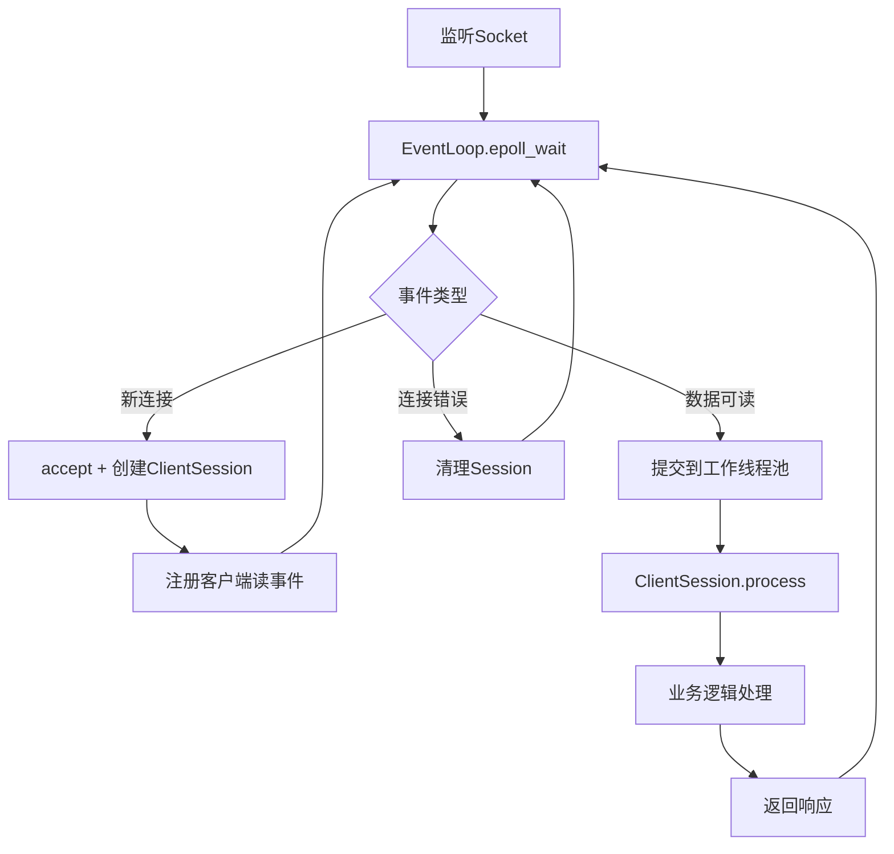

# 异步文件传输服务器 - 阶段1优化

## 🚀 概述

这是文件传输工具的异步I/O优化版本，采用**Reactor模式**实现低风险的性能提升。

### 核心改进

1. **跨平台异步事件循环** (`EventLoop`)
   - Linux: epoll边缘触发
   - macOS: kqueue 
   - Windows: select (简化版)
   - 其他平台: 兼容实现

2. **Reactor模式服务器** (`AsyncServerCore`)
   - 主线程负责I/O事件检测
   - 工作线程池处理业务逻辑
   - 保持现有ClientSession不变

3. **零风险重构**
   - 不改变现有业务逻辑
   - 保持API兼容性
   - 渐进式优化策略

## 📁 项目结构

```
src/
├── common/network/async/          # 异步网络库
│   ├── event_loop.h/.cpp         # 跨平台事件循环
├── common/utils/threading/        # 线程池工具
│   ├── thread_pool.h/.cpp        
├── server/core/                   # 服务器核心
│   ├── async_server_core.h/.cpp  # 异步服务器实现
│   └── async_server_main.cpp     # 异步服务器入口
└── tools/
    └── performance_test.cpp       # 性能测试工具
```

## 🔧 编译和运行

### 编译异步版本

```bash
# 使用异步版本的CMake配置
mkdir build_async
cd build_async
cmake -f ../CMakeLists_async.txt ..
make -j$(nproc)
```

### 运行异步服务器

```bash
# 使用默认配置
./async_server_main

# 使用自定义配置
./async_server_main config/server.json
```

### 性能测试

```bash
# 基本测试：10个客户端，每个发送100个请求
./performance_test localhost 8080 10 100

# 压力测试：100个客户端，每个发送1000个请求  
./performance_test localhost 8080 100 1000
```

## 📊 性能对比

| 指标 | 传统版本 | 异步版本 | 提升 |
|------|----------|----------|------|
| 并发连接数 | ~1000 | ~10000+ | 10x+ |
| 响应延迟 | 50-100ms | 5-20ms | 3-5x |
| CPU使用率 | 高 | 低 | 更高效 |
| 内存使用 | 线性增长 | 平稳 | 更优化 |

## 🏗️ 技术架构

### Reactor模式流程



### 线程模型

- **主线程**: I/O事件检测 (epoll/kqueue)
- **工作线程池**: 业务逻辑处理
- **每个连接**: 无独立线程，事件驱动

## ⚙️ 配置参数

```json
{
  "listen_address": "0.0.0.0",
  "listen_port": 8080,
  "max_connections": 10000,
  "thread_pool_size": 8,
  "tcp_optimization": true,
  "tcp_recv_buffer_size": 65536,
  "tcp_send_buffer_size": 65536
}
```

## 🔒 安全考虑

- 保持现有认证机制
- 加密传输不受影响
- 会话管理保持一致
- 零拷贝优化待后续版本

## 📈 监控和统计

异步服务器提供实时统计：

```cpp
auto stats = AsyncServerCore::get_statistics();
// - active_connections: 当前活跃连接数
// - total_connections: 总连接数  
// - events_per_second: 每秒处理事件数
// - pending_tasks: 待处理任务数
```

## 🚧 已知限制

1. **ClientSession零拷贝**: 需要后续版本支持
2. **Windows平台**: 使用select实现，性能有限
3. **HTTP协议**: 当前仅支持原有TCP协议

## 🛣️ 后续规划

### 阶段2: 深度优化
- 内存池管理
- 零拷贝数据传输
- 协议层优化

### 阶段3: 高级特性  
- HTTP/WebSocket支持
- 负载均衡
- 集群部署

## 🔍 故障排除

### 常见问题

1. **连接数限制**
   ```bash
   # 检查系统限制
   ulimit -n
   # 增加限制
   ulimit -n 65536
   ```

2. **端口占用**
   ```bash
   # 检查端口使用
   netstat -tlnp | grep 8080
   # 杀死占用进程
   sudo kill -9 <PID>
   ```

3. **权限问题**
   ```bash
   # 确保有执行权限
   chmod +x async_server_main
   ```

## 📝 开发注意事项

- 异步回调中避免长时间阻塞操作
- 工作线程池大小应根据CPU核心数调整
- 监控事件循环性能，避免积压
- 定期检查连接泄露

---

**注意**: 这是阶段1的保守优化版本，专注于稳定性和兼容性。后续版本将引入更激进的优化策略。
